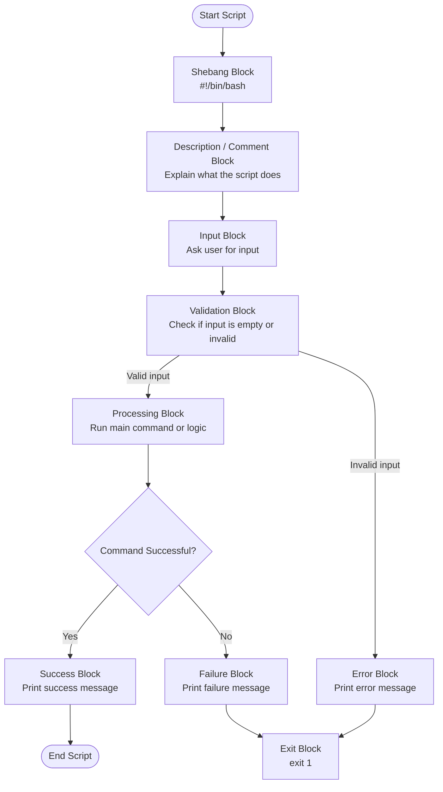

# Bash Script Mermaid Flowchart Study Notes

## Topic

**Bash Script Mermaid Flowchart with Block Names and Step-by-Step Explanation**

---

## What Is This Diagram Called?

This type of diagram is called a:

- **Mermaid flowchart**
- **Bash script block diagram**
- **Script logic flowchart**
- **Bash workflow diagram**
- **Step-by-step script flow diagram**

Best way to ask next time:

```text
Create a Mermaid flowchart for this Bash script with block names and step-by-step explanation.
```

---

## Why Do We Create a Flowchart Before Writing a Script?

Before writing a Bash script, it is very helpful to understand the script logic first.

A flowchart helps us answer:

- Where does the script start?
- What input is required?
- What validation is needed?
- What happens if the input is correct?
- What happens if the input is wrong?
- Where should the script stop?
- What is the successful path?
- What is the failure path?

This is a professional way to think before scripting.

---

## Bash Script Mermaid Flowchart



---

## Example Bash Script

```bash
#!/bin/bash

# Description:
# This script asks for a filename, checks if it exists,
# and prints whether the file is available or missing.

echo "Enter file name:"
read filename

if [ -z "$filename" ]; then
    echo "Error: filename cannot be empty"
    exit 1
fi

if [ -f "$filename" ]; then
    echo "File exists: $filename"
else
    echo "File does not exist: $filename"
    exit 1
fi

echo "Script completed successfully"
```

---

# Block-by-Block Explanation

---

## 1. Start Script Block

```mermaid
A([Start Script])
```

### Block Name

**Start Script Block**

### What It Does

This shows where the script begins.

In a real Bash script, execution starts from the first line and moves downward.

---

## 2. Shebang Block

```bash
#!/bin/bash
```

### Block Name

**Shebang Block**

### What It Does

This tells Linux to run the script using Bash.

Simple meaning:

```text
Use Bash shell to execute this script.
```

### Why It Is Important

Without the shebang, Linux may not know which shell should run the script.

---

## 3. Description / Comment Block

```bash
# Description:
# This script asks for a filename...
```

### Block Name

**Description Block**

### What It Does

Comments explain the purpose of the script.

Bash ignores these lines during execution.

They are for humans, not the computer.

---

## 4. Input Block

```bash
echo "Enter file name:"
read filename
```

### Block Name

**Input Block**

### What It Does

This asks the user to enter a filename.

Then it stores the answer in a variable called:

```bash
filename
```

Example user input:

```text
notes.txt
```

---

## 5. Validation Block

```bash
if [ -z "$filename" ]; then
    echo "Error: filename cannot be empty"
    exit 1
fi
```

### Block Name

**Validation Block**

### What It Does

This checks whether the user entered something or left it empty.

### Meaning of `-z`

```bash
-z
```

means:

```text
Check if the string is empty.
```

So this line:

```bash
[ -z "$filename" ]
```

means:

```text
Is filename empty?
```

---

## 6. Error Block

```bash
echo "Error: filename cannot be empty"
exit 1
```

### Block Name

**Error Block**

### What It Does

If the user does not enter a filename, the script prints an error.

Then it stops the script with:

```bash
exit 1
```

### Meaning of `exit 1`

```text
The script failed.
```

In Linux and Bash scripting:

- `exit 0` means success
- `exit 1` means failure

---

## 7. Processing / File Check Block

```bash
if [ -f "$filename" ]; then
```

### Block Name

**Processing Block** or **File Check Block**

### What It Does

This checks if the file exists and is a regular file.

### Meaning of `-f`

```bash
-f
```

means:

```text
Check if this is a regular file.
```

---

## 8. Success Block

```bash
echo "File exists: $filename"
```

### Block Name

**Success Block**

### What It Does

If the file exists, the script prints a success message.

Example output:

```text
File exists: notes.txt
```

---

## 9. Failure Block

```bash
echo "File does not exist: $filename"
exit 1
```

### Block Name

**Failure Block**

### What It Does

If the file does not exist, the script prints a failure message and stops.

The script stops because of:

```bash
exit 1
```

---

## 10. End Script Block

```bash
echo "Script completed successfully"
```

### Block Name

**End Block**

### What It Does

This prints a final message when everything is successful.

This line will run only if the script did not fail earlier.

---

# Simple Flow in Human Words

```text
Start script
Read filename from user
Check if filename is empty
If empty, show error and stop
If not empty, check if file exists
If file exists, show success
If file does not exist, show error and stop
End script
```

---

# Best Template for Any Bash Script Diagram

You can use this structure for almost every Bash script:

```text
Start
Shebang
Description
Variables
Input
Validation
Main Logic
Condition Check
Success
Failure
Exit
End
```

---

# Useful Bash Test Operators

| Operator | Meaning | Example |
|---|---|---|
| `-z` | String is empty | `[ -z "$name" ]` |
| `-n` | String is not empty | `[ -n "$name" ]` |
| `-f` | Regular file exists | `[ -f "$file" ]` |
| `-d` | Directory exists | `[ -d "$dir" ]` |
| `-r` | File is readable | `[ -r "$file" ]` |
| `-w` | File is writable | `[ -w "$file" ]` |
| `-x` | File is executable | `[ -x "$file" ]` |
| `-e` | File or directory exists | `[ -e "$path" ]` |

---

# Good Practice

When writing Bash scripts, try to follow this thinking process:

1. Write the purpose of the script.
2. Decide what input is needed.
3. Validate the input.
4. Run the main command or logic.
5. Check if the command succeeded or failed.
6. Print a clear success or error message.
7. Use proper exit codes.

---

# Final Summary

A Bash script flowchart helps you understand the logic before writing code.

It breaks the script into clear blocks such as:

- Start block
- Shebang block
- Description block
- Input block
- Validation block
- Processing block
- Success block
- Failure block
- Exit block
- End block

This is very useful for learning, teaching, troubleshooting, and writing clean automation scripts.

